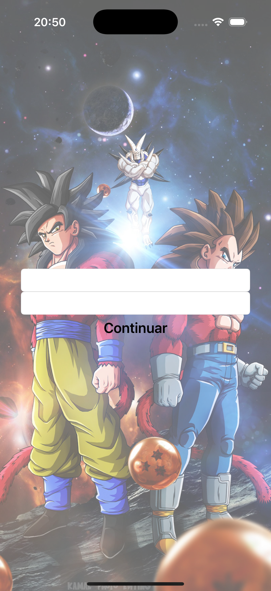
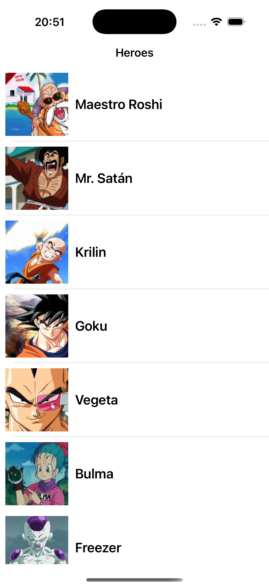
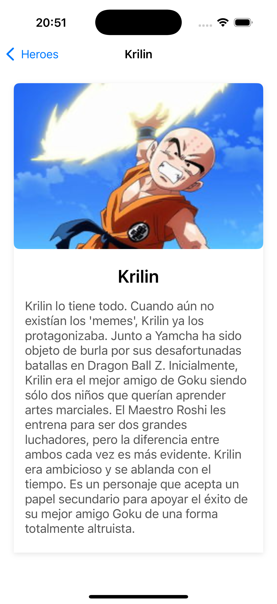

# DragonBall Heroes

DragonBall Heroes es una aplicación iOS que permite a los usuarios explorar los personajes del universo Dragon Ball y sus transformaciones. La aplicación consume una API REST para mostrar información sobre los héroes y sus distintas formas.

## Screenshots

<table>
  <tr>
    <td> <em>Login</em></td>
    <td> <em>Lista de heroes</em></td>
    <td> <em>Detalles del heroe</em></td>
  </tr>
</table>

## Especificaciones

**Credenciales:**
- Email: tu dirección de email  
- Password: tu contraseña

**Arquitectura:** MVVM (Model-View-ViewModel)  
**Interfaces:** XIBs y UI programática  

## Requisitos Completados

### Funcionalidades Básicas ✅
- Sistema de login con autenticación
- Listado de héroes con imágenes y descripciones
- Detalle de héroe con información completa
- Visualización de transformaciones para cada héroe
- Navegación entre pantallas

### Funcionalidades Técnicas ✅
- Consumo de API REST con tokens de autenticación
- Carga asíncrona de imágenes
- Manejo de estados de carga y errores
- Interfaces programáticas y con XIBs
- Unit Tests para ViewModels

### Arquitectura ✅
- Patrón MVVM (Model-View-ViewModel)
- Sistema de binding para actualización de UI
- Separación clara de responsabilidades
- Servicios de networking centralizados
- Modelo de datos completo

## Consideraciones y Comentarios

### Arquitectura del Proyecto
El proyecto está organizado en las siguientes carpetas:

- **Data**: Fuentes de datos y repositorios
  - **DataSources**: Proveedores de datos (API, local)
  - **Entities**: DTOs para comunicación con API
  - **Mappers**: Conversores entre entidades y modelos
  - **Requests**: Definiciones de peticiones HTTP
- **Domain**: Lógica de negocio
  - **Models**: Modelos de dominio (HeroModel)
  - **UseCases**: Casos de uso de la aplicación
- **Networking**: Implementación de comunicación con API
  - **APISession**: Manejo de sesiones HTTP
  - **HTTPRequest**: Protocolos para peticiones
  - **APIInterceptor**: Interceptores para autenticación
- **Presentation**: Capa de presentación
  - **Components**: Componentes reutilizables de UI
  - **Login**: Vista de login y autenticación
  - **HeroesList**: Lista de personajes
  - **HeroDetail**: Detalle de cada héroe
  - **Splash**: Pantalla de inicio
- **SupportingFiles**: Recursos y archivos auxiliares
- **Tests**: Pruebas unitarias y de integración

### Mejoras Implementadas en este Proyecto

#### Patrón MVVM
- **ViewModels**: Capa intermedia entre Models y Views
- **Bindings**: Sistema de observación para actualizar la UI
- **Estados**: Manejo de estados de UI (loading, error, success)

#### Testing
- Tests unitarios para ViewModels con dependencias mockeadas
- Uso de expectativas para tests asíncronos
- Tests de éxito y fracaso para cada ViewModel

#### Design Patterns adicionales
- **Builder Pattern**: Construcción de ViewControllers
- **Repository Pattern**: Abstracción de fuentes de datos
- **Dependency Injection**: Inversión de dependencias

## Instrucciones de Uso
1. Iniciar la aplicación
2. Ingresar credenciales en la pantalla de login
3. Explorar la lista de héroes de Dragon Ball
4. Seleccionar un héroe para ver su detalle

## Componentes Principales
- **LoginViewModel**: Gestiona la lógica de autenticación
- **HeroesListViewModel**: Maneja la obtención y filtrado de héroes
- **HeroDetailViewModel**: Controla la presentación de detalles de héroe
- **AsyncImage**: Componente para carga asíncrona de imágenes
- **Binding<T>**: Sistema genérico de binding para la arquitectura MVVM

## 🔄 Lo Que Me Llevo de Este Proyecto 🔄

### 🏗️ Patrones y Estructuras
- Implementación de arquitectura MVVM
- Sistema de bindings para actualizar la UI
- Separación clara de capas (Presentation, Domain, Data)
- Uso de protocolos para abstraer implementaciones

### 📐 Arquitectura Avanzada
- Transición de MVC a MVVM
- Inversión de dependencias
- Testabilidad mejorada
- Mejor separación de responsabilidades

### ✅ Aprendizajes Clave
- Implementación correcta de tests unitarios con mocks
- Creación de UIs programáticas y con XIBs
- Manejo de estados de UI a través de ViewModels
- Gestión de dependencias mediante inyección
